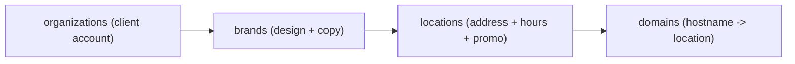
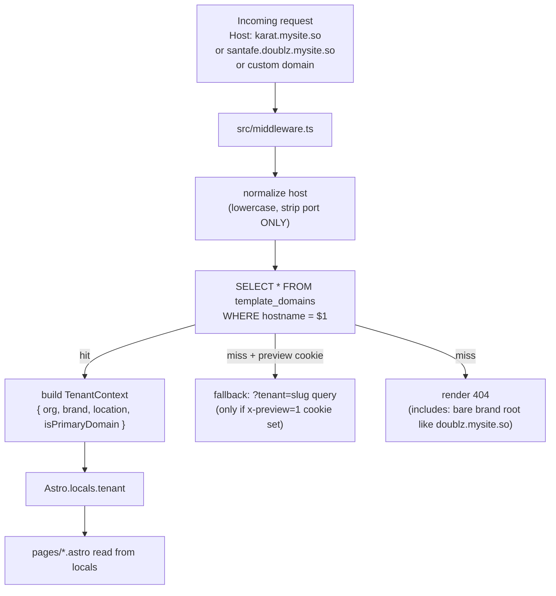

## Goals

- **One codebase, hundreds of sites.** Single Vercel deploy, wildcard domains (`*.mysite.so` and `*.*.mysite.so`), host-based tenant resolution. Note: `mysite.so` is the customer-facing site domain; `mysite.cx` remains the internal ops/API domain (`attribution.mysite.cx`) — they are intentionally separate.
- **Design language.** MySite's shadcn `base-nova` tokens (Geist, OKLCH neutrals) applied through Apple-Maps composition patterns (translucent floating panels, action tiles, map cards).
- **Trivially onboardable.** Adding a new client = insert rows in Supabase + point DNS. Zero code changes.
- **Developer-ready.** Small, obvious file tree; every module <200 LOC; typed end-to-end; a single `docs/` folder that a new dev can read in 15 minutes.

## Tech Stack

- **Astro 5** (`output: "server"`, `@astrojs/vercel`) for SSR + per-request tenant resolution.
- **React 19 islands** for interactive UI (menu tabs, gallery lightbox, promo/QR flow, language switcher).
- **shadcn/ui `base-nova`** vendored into `src/components/ui/`, `baseColor: "neutral"`, `cssVariables: true`. Tokens copied verbatim from MySite admin (see Design System).
- **Tailwind CSS 4** (via `@tailwindcss/vite`) with `@theme inline` mapping from CSS variables — same shape as [admin/src/index.css](/Users/patrykpijanowski/git/attribution-autopilot/admin/src/index.css).
- **Fonts**: `@fontsource-variable/geist` (Geist Variable) as `--font-sans`.
- **Supabase** (NEW dedicated project) for tenant content (`@supabase/supabase-js`, service role on server only, publishable key never shipped).
- **TypeScript 5**, strict.
- **Deployment**: single Vercel project, wildcard domains `*.mysite.so` + `*.*.mysite.so` (nested for multi-location brands) + custom domains attached per-client.

## Hosting / Domain Model

> **Two prerequisites to verify before shipping:**
> 1. **`mysite.so` domain ownership.** `mysite.so` does not appear anywhere in `attribution-autopilot` or `wbc-v2` today — every existing product surface is on `mysite.cx`. Confirm the `.so` domain is registered and pointed at Vercel before the wildcard-domain runbook is authored.
> 2. **Vercel TLS for `*.*.mysite.so`.** Standard Let's Encrypt ACME wildcards cover one label only (`*.mysite.so` covers `karat.mysite.so`, **not** `santafe.doublz.mysite.so`). Verify with Vercel that automatic cert issuance supports a wildcard-of-wildcard on the same project. If not, restructure to flat `<location>-<brand>.mysite.so` (e.g. `santafe-doublz.mysite.so`) — this is a single-level wildcard and works with the same DB-driven resolution. Decide this before writing `docs/02-adding-a-client.md`.

The template supports two host patterns simultaneously, both resolved by the same middleware from the `template_domains` table:

- **Single-location**: `<location>.mysite.so` — e.g. `karat.mysite.so`. For single-location clients, `brand.slug === location.slug` (they collapse). Custom domain: `karat.pl` or `www.karat.pl`.
- **Multi-location**: `<location>.<brand>.mysite.so` — e.g. `santafe.doublz.mysite.so`. Custom domain: `santafe.doublz.mysite.co` (or any brand-owned subdomain).
- **Brand root without a location** (`doublz.mysite.so`) → **404**. Every valid URL must resolve to a specific location. Documented as a deliberate rule in `docs/02-adding-a-client.md`.

Vercel domain configuration:

- Two wildcard entries: `*.mysite.so` (covers single-location) and `*.*.mysite.so` (covers multi-location — subject to the wildcard-of-wildcard TLS verification in the prerequisites above; fall back to flat `<location>-<brand>.mysite.so` if unsupported).
- Each custom domain per client is added individually in Vercel dashboard (a `docs/02-adding-a-client.md` runbook step).

`template_domains` is authoritative — the middleware does not parse the host structurally. Instead every hostname (`karat.mysite.so`, `santafe.doublz.mysite.so`, `karat.pl`, `santafe.doublz.mysite.co`, `www.karat.pl`) is a **row** pointing at a single `location_id`. This means:

- Both wildcard forms and custom domains use identical code paths.
- Adding an alias domain (e.g. attaching `www.karat.pl` alongside `karat.pl`) = one row insert.
- No structural coupling between URL shape and org/brand/location hierarchy — the hierarchy lives in the data, not the URL.

## Domain Model (Supabase — NEW dedicated project)

**Provisioning step (documented in `docs/05-supabase-schema.md`):** create a brand-new Supabase project named `website-template` (separate from `attribution-autopilot`, `wbc-token`, `attribution-token`, and any existing MySite project). Reason: this project's schema, RLS, and access patterns are unrelated to attribution — it holds public read-only marketing content served to every restaurant visitor. Keeping it isolated prevents accidental cross-contamination, simplifies RLS, and lets us hand the project to a non-technical operator without exposing attribution PII.

**Migration hygiene note.** Unlike `attribution-autopilot` — whose base tables (`organizations`, `locations`, `users`, `promotions`, `loyalty_campaigns`) were created in Supabase Studio and whose `001_enable_rls.sql` only enables RLS on `ALTER TABLE IF EXISTS` — every `template_*` table in this project is created **via SQL migrations checked into git**. This is a deliberate improvement: reproducible schema, reviewable diffs, no drift between Studio and the repo.

**Modeling note on `template_brands`.** `attribution-autopilot` has no `brands` table — its hierarchy is `organizations → locations` directly. `template_brands` is therefore a **new modeling decision** specific to this template, introduced to solve two problems that don't exist on the attribution side: (a) URL shape for multi-location brands (`<location>.<brand>.mysite.so`), and (b) shared design tokens + copy across locations under one brand. It should not be described in docs as "mirroring the attribution schema" — it isn't.

Three-tier hierarchy that maps naturally to both single- and multi-location clients:



New tables (in the brand-new `website-template` Supabase project, migrations in `supabase/migrations/`):

- `template_organizations` — client account. Fields: `id`, `slug`, `name`, `default_locale`.
- `template_brands` — one row per brand. Design tokens + logo + copy tone live here. Fields: `id`, `org_id`, `slug`, `name`, `logo_url`, `theme` (JSONB — narrow override: `{ primary?: oklch, primary_foreground?: oklch }`; defaults to MySite grayscale — `radius` is intentionally NOT overridable, see Design System), `tagline`, `about_md`.
- `template_locations` — Fields: `id`, `brand_id`, `slug`, `name`, `address_line`, `city`, `region`, `postal_code`, `country`, `latitude`, `longitude`, `phone`, `email`, `weekday_hours`, `weekend_hours`, `maps_embed_url`, `maps_search_query`, `instagram_url`, `facebook_url`, `delivery` (JSONB `{name,url}[]`), `attribution_promotion_id`, `attribution_campaign_id`, `attribution_org_id`, `attribution_location_id` (the last four are the FKs into the `attribution-autopilot` Supabase project — `attribution_location_id` is the value operators use when inserting into `attribution-autopilot.location_origins`), `umami_website_id`, `meta_pixel_ids` (text[]), `gallery` (JSONB — `{ src: string; alt: string }[]`), `menu` (JSONB — see Menu JSON Shape below).
- `template_domains` — Fields: `hostname` (unique, lowercased, stored exactly as sent; `www.karat.pl` and `karat.pl` are separate rows), `location_id`, `is_primary` (only one primary per location — enforced by a partial unique index: `CREATE UNIQUE INDEX ON template_domains(location_id) WHERE is_primary; used for canonical URLs + JSON-LD `url`), `kind` (`mysite_single` | `mysite_multi` | `custom` — metadata only, not used for resolution). Additional CHECK constraint: `hostname` must not match `^[a-z0-9-]+\.mysite\.so$` — this enforces the "bare brand root → 404" rule at the DB level, not just by absence-of-row. This is the resolution index. Examples of rows for one brand:
  - `karat.mysite.so` → `location_id=<karat>`, `is_primary=true`, `kind=mysite_single`
  - `karat.pl` → same `location_id`, `is_primary=false`, `kind=custom`
  - `www.karat.pl` → same `location_id`, `is_primary=false`, `kind=custom` (separate row — hostnames are stored exact-match, no `www.` stripping)
  - `santafe.doublz.mysite.so` → `location_id=<santafe>`, `is_primary=true`, `kind=mysite_multi`
  - `santafe.doublz.mysite.co` → same `location_id`, `is_primary=false`, `kind=custom`

### Menu JSON Shape

The `template_locations.menu` blob follows one canonical TypeScript shape. `MenuBrowser.tsx` renders exactly this shape — operators must conform (validated in `docs/05-supabase-schema.md` with a copy-pasteable JSON template):

```ts
// src/lib/menu/types.ts
export type Money = { amount: number; currency: 'PLN' | 'EUR' | 'USD' };

export interface MenuItem {
  id: string;              // stable slug within category, e.g. "flat-white"
  name: string;
  description?: string;
  price?: Money;           // omit for market-price / seasonal
  image_url?: string;
  tags?: Array<'vegan' | 'vegetarian' | 'gluten-free' | 'spicy' | 'new'>;
  allergens?: string[];    // free-form, e.g. ['milk', 'nuts']
}

export interface MenuCategory {
  id: string;              // stable slug, e.g. "coffee"
  name: string;            // display name
  description?: string;
  items: MenuItem[];
}

export interface Menu {
  version: 1;
  currency_default: 'PLN' | 'EUR' | 'USD';
  categories: MenuCategory[];
}
```

Enforced at read time by a zod parser in `src/lib/menu/parse.ts`. If a location's `menu` blob fails validation, the `/menu` route falls back to a "menu coming soon" state rather than crashing.

### RLS (implemented in `003_rls.sql`)

**Decision: `anon_deny_all` on every `template_*` table**, matching `attribution-autopilot`'s pattern.

Rationale: tenant resolution runs entirely in Astro middleware using `SUPABASE_SERVICE_ROLE_KEY` server-side (see Tenant Resolution Flow). The template ships **zero client-side Supabase reads** — all rendering happens SSR against server-only data. Denying anon access outright is simpler and safer than curating column-level policies, and `template_locations.phone` / `template_locations.email` never leak because they only ever pass through the SSR layer, never to the client's Supabase client (there is none).

Any future client-side Supabase feature must justify opening a specific column-level anon policy and must exclude PII columns (`phone`, `email`).

## Tenant Resolution Flow



- **`src/middleware.ts`** — reads `Astro.request.headers.get('host')`, normalizes (**lowercase + strip port only** — `www.` is NOT stripped, `www.karat.pl` and `karat.pl` are separate rows in `template_domains`), calls `resolveTenant(host)` from `src/lib/tenant/resolve.ts`, attaches `Astro.locals.tenant`. In-memory LRU cache with 60s TTL keyed by hostname (natural TTL only — no Supabase realtime invalidation in v1; a redeploy or the 60s TTL is how operators pick up domain changes).
- **The middleware treats every URL shape identically** — `karat.mysite.so`, `santafe.doublz.mysite.so`, `karat.pl`, `www.karat.pl`, `santafe.doublz.mysite.co` are all just hostnames looked up in `template_domains`. There is **no structural parsing** of the host (no "if 2 dots then it's multi-location" logic, no `www.` alias-collapse). This is a deliberate simplification: URL patterns are documentation, the DB is the source of truth.
- **Bare brand root `doublz.mysite.so` → 404** at two levels: (a) no such row exists in `template_domains`, and (b) the CHECK constraint on `template_domains.hostname` would reject the row anyway if an operator tried to insert it. Defense in depth.
- **Canonical URL / redirect (optional, v1.1)**: if `hostname` matches a non-primary alias, middleware can 301 to the primary. Off by default in v1 to avoid surprises; toggle in `docs/`.
- **Preview override** via `?tenant=slug` query — gated by an `x-preview=1` cookie set by a lightweight basic-auth-protected `/preview/enable` endpoint (implementation in `docs/06-developer-guide.md`). The DEV clause is removed because `import.meta.env.DEV` is inlined as `false` at Vercel build time and would be dead code in production.
- Every `.astro` page reads `Astro.locals.tenant` — no per-page fetching, no prop drilling.

## Pages (v1 scope)

Three routes, all SSR, tenant-scoped:

1. **`src/pages/index.astro`** — Apple-Maps-style landing. Sections: hero (name, tagline, hours pill, primary CTA), quick actions (call, directions, delivery, menu), gallery, about, reviews summary, map iframe, footer with MySite badge.
2. **`src/pages/menu.astro`** — Renders `location.menu` JSON via a React island `<MenuBrowser client:visible>` with sticky category tabs.
3. **`src/pages/promocja.astro`** — Loyalty/QR page. Mounts `<PromoFlow client:load>` React island (see integration section).
4. **`src/pages/404.astro`** — Unknown-host or unknown-slug fallback.

## Attribution Autopilot Integration

Per user's direction, this section is a **verbatim port of wbc-v2's `useQrTracker`** — same endpoints, same payload shape, same phone-append + duplicate-recovery flow. The flow is proven in production (wbc-v2 has been live on it). It is **not** modelled on `attribution-autopilot/embed/src/tracking.ts` (the drop-in embed) — the embed captures a slightly different superset (`gclid`/`gbraid`/`wbraid`) that wbc-v2 does not send, and matching wbc-v2 exactly is the priority.

- **`src/lib/attribution/client.ts`** — thin `fetch` wrapper around `POST /api/users`, `PATCH /api/users/:id/phone`, `GET /api/users/:id`, `GET /api/users/phone/:phone`, `POST /api/users/recover/{request,verify}`. Base URL = `PUBLIC_ATTRIBUTION_API_BASE` (default `https://attribution.mysite.cx/api`).
- **`src/lib/attribution/tracking.ts`** — collects `_fbc`/`_fbp`/`_ga`/first `_ga_*`, `fbclid`, UTMs, `r`/`c`, `multiFbc` from `localStorage`. Payload shape is exactly [wbc-v2's `useQrTracker.ts` register body](/Users/patrykpijanowski/git/wbc-v2/src/hooks/useQrTracker.ts) (lines 114–131). `gclid`/`gbraid`/`wbraid` are intentionally NOT captured — matches wbc-v2. If future Google Ads attribution is needed, they're one-line additions per key (the backend `CreateUserDto` already accepts them).
- **`src/lib/attribution/useAttribution.ts`** — React hook, direct port of `useQrTracker.ts`, adapted to read `promotion_id/campaign_id/org_id` from tenant context (`Astro.locals.tenant.location.attribution_*` fields) instead of `useLocationConfig()`. Same `registerPromise` + `lockRef` dedupe, same `localStorage.qr_user` / `localStorage.qr_user_phone` caching, same `GET /users/phone/:phone` probe-then-swap duplicate-detection in `savePhone`.
- **`src/components/promo/PromoFlow.tsx`** — React island. Mirrors wbc-v2's `Promocja.tsx` flow: `teaser → revealed → phone → done`. Emits the same Meta Pixel event pair (`QRGenerated` on reveal, `Lead` on phone save), dedup'd via `trackMetaEventOnce`.
- **`src/lib/promo/shareQrImage.ts`** — port of `saveQrImage()` from [wbc-v2's Promocja.tsx](/Users/patrykpijanowski/git/wbc-v2/src/pages/Promocja.tsx) lines 15–81. Renders the QR + reward + address + domain + "powered by mysite.ai" as a 600×800 PNG on a canvas, then invokes `navigator.share` with the file (falling back to download). This is a real feature of wbc-v2's promo page and must be preserved.
- **`src/components/attribution/MetaPixel.tsx`** — React island (`client:load`) that initializes the Meta Pixel from `location.meta_pixel_ids`. Consistent with `PromoFlow`'s use of `trackQrGenerated`/`trackLeadSubmitted`.
- **`src/components/attribution/Umami.tsx`** — React island (`client:load`) that injects the Umami script tag with `data-website-id={location.umami_website_id}` and `data-host-url="/stats"`. Same-origin `/stats/` proxy configured in `vercel.json` (see below).

**Note on component file extensions.** Both `MetaPixel` and `Umami` are `.tsx` React islands (not `.astro`) because they need runtime access to `location.meta_pixel_ids` / `location.umami_website_id` from tenant context and need to fire client-side event tracking. The directory layout further down uses `.tsx` accordingly.

### Promo name + reward description from attribution — required prerequisite change

wbc-v2 hardcodes the promo/reward display strings in `src/config/locations.ts`. For a template driving hundreds of sites, the promo name and first-reward description must come **from attribution-autopilot** — otherwise every promo rename requires editing per-tenant Supabase rows.

`POST /api/users` currently returns:

```ts
// src/users/users.service.ts (attribution-autopilot)
export type CreateUserResult =
  | { status: 'created'; id: string; full_code: string; first_reward_code: string | null }
  | { status: 'exists'; requires_recovery: true; message: string };
```

The `PromotionsService.findOne(dto.promotion_id)` call already runs inside `create()` (line 138 of `users.service.ts`) and the first reward is already fetched to compute `first_reward_code`. **Extend the response to include the display strings** — zero new endpoints, zero CORS/origin changes (`GET /api/promotions/*` is admin-origin-gated and cannot be called from a `karat.mysite.so` origin):

```ts
// Proposed shape (backend PR tracked as prereq in docs/04-attribution-integration.md)
export type CreateUserResult =
  | {
      status: 'created';
      id: string;
      full_code: string;
      first_reward_code: string | null;
      promotion_name: string;              // NEW — from PromotionsService.findOne
      first_reward_description: string | null;  // NEW — from the same reward already fetched
    }
  | { status: 'exists'; requires_recovery: true; message: string };
```

`useAttribution.ts` stores these on the cached `QrUser` in `localStorage.qr_user`. The `QrUser` interface already declares `promotion_name?: string` (line 9 of wbc-v2's `useQrTracker.ts`) so the type shape is a superset-compatible addition on the client. Pre-reveal rendering (showing the promo name in the hero before the user clicks "reveal QR") is handled by denormalizing `promotion_name` into `template_locations.promotion_name_cached` on onboarding, refreshed on demand — see `docs/04-attribution-integration.md` for the refresh procedure. **This is `attribution-autopilot`'s only required backend change to unblock the template.**

### Server-side event IDs (in v1, not out of scope)

`CreateUserDto` already accepts `qr_event_id` and `lead_event_id`. The template **passes both** from day one — Meta Pixel event id generated client-side, then forwarded via the `useAttribution.register({ qrEventId })` and `useAttribution.savePhone(phone, { leadEventId })` calls, exactly as wbc-v2 does. Backend fans out to CAPI/Rudderstack/CustomerIO server-side (already wired). The "server-side pixel/CAPI events (client-only for v1)" line in Out of Scope was misleading — reclassified below.

### CORS onboarding — one path, not two

**Every new hostname must be added to `attribution_autopilot.location_origins`** (referenced by `template_locations.attribution_location_id`). The static regex list in `src/common/origin-allowlist.ts` is an alternative in principle but requires a backend redeploy + code review; it's not compatible with the "zero-code onboarding" goal and should not be used for template clients. `docs/04-attribution-integration.md` documents only the `location_origins` INSERT path.

**60-second cache lag.** `LocationsService.getAllOriginsCached()` caches the origin list for 60 seconds. A newly onboarded hostname has up to ~60 seconds of CORS failure before the cache refreshes. Onboarding runbook (`docs/02-adding-a-client.md`) must state this — operators should wait 60s after the INSERT before smoke-testing `/promocja`.

## Design System

**The base is MySite's own shadcn design system**, not a from-scratch Apple palette. Source of truth: [attribution-autopilot/admin/src/index.css](/Users/patrykpijanowski/git/attribution-autopilot/admin/src/index.css) and [attribution-autopilot/admin/components.json](/Users/patrykpijanowski/git/attribution-autopilot/admin/components.json). Apple-Maps is applied as a *composition layer* (surface treatments, whitespace rhythm, section shapes) — not as tokens.

### Base tokens (copied verbatim from MySite admin)

- **shadcn config**: `style: "base-nova"`, `baseColor: "neutral"`, `iconLibrary: "lucide"`, `cssVariables: true`.
- **Font**: `@fontsource-variable/geist` — `--font-sans: 'Geist Variable', sans-serif`.
- **Color space**: OKLCH throughout. Light-mode neutrals `--background: oklch(1 0 0)`, `--foreground: oklch(0.145 0 0)`, `--primary: oklch(0.205 0 0)` (near-black), `--muted: oklch(0.97 0 0)`, `--border: oklch(0.922 0 0)`. Full dark-mode counterpart included.
- **Radius scale**: `--radius: 0.625rem` with a full `sm..4xl` computed scale (`sm = 0.6×`, `md = 0.8×`, `lg = 1×`, `xl = 1.4×`, `2xl = 1.8×`, `3xl = 2.2×`, `4xl = 2.6×`) — this is what gives the MySite "generously rounded but consistent" feel.
- **Tailwind 4** with `@theme inline` mapping every `--color-*` and `--radius-*` variable — same block as [admin/src/index.css](/Users/patrykpijanowski/git/attribution-autopilot/admin/src/index.css).

`src/styles/tokens.css` is essentially a copy of `admin/src/index.css`, so any change made to MySite's admin theme can be pulled in with a diff. This is a **deliberate choice**: it keeps the operator dashboard (admin), the guest dashboard (vibes), and the restaurant sites visually coherent as one product family.

### Apple-Maps composition layer

Applied on top of the MySite tokens — not by changing colors, but by how surfaces are composed. Defined in `src/styles/components.css`:

- **`.map-card`** — the primary content container. `bg-card/72 backdrop-blur-xl border border-border/60 rounded-2xl shadow-[0_1px_2px_rgb(0_0_0/0.04),0_8px_24px_rgb(0_0_0/0.06)]`. Used for hero, hours, gallery, about, and delivery blocks.
- **`.action-tile`** — the 4-up quick-action grid you see under an Apple Maps place header (Call · Directions · Menu · Order). Square-ish, tap-target ≥64px, icon over label, `rounded-xl`.
- **`.pill`** — small status chips (Open Now · Closes 21:00 · ⭐ 4.8). Uses `--muted` + `--foreground` from base tokens.
- **`.floating-panel`** — the translucent sheet that slides up on mobile / docks left on desktop. `backdrop-blur-2xl bg-background/80`.
- **Layout rhythm**: mobile-first single column, `max-w-md` content well like [wbc-v2's Index.tsx](/Users/patrykpijanowski/git/wbc-v2/src/pages/Index.tsx), `space-y-4` between cards, generous 5rem section padding on desktop.
- **No custom brand color** at the base — MySite is grayscale neutral by design. Brands can *tint* accents through `BrandStyleTag` (see below), but the default remains grayscale to look like the MySite family.

### Per-brand override

`brands.theme` (JSONB in Supabase) can override just two variables at runtime — kept intentionally narrow:

- `--primary` (defaults to MySite near-black) — accepts an OKLCH string.
- `--primary-foreground`

**`--radius` is deliberately NOT overridable.** The admin `@theme inline` block defines the derived scale as `--radius-sm: calc(var(--radius) * 0.6)` … `--radius-4xl: calc(var(--radius) * 2.6)`. In Tailwind 4, `@theme inline` values are resolved at CSS-generation time, not runtime — so injecting `<style>:root{--radius: 1rem}</style>` at request time would change `--radius` itself but leave the derived `sm..4xl` scale bound to the build-time value. The result would be a broken, inconsistent radius. If per-brand radius override becomes a real requirement later, the correct fix is to move the radius scale out of `@theme inline` (into plain `@theme` or a separate CSS block that references `var(--radius)` directly) — deferred until an actual client asks.

`<BrandStyleTag brand={tenant.brand} />` renders a single `<style>` element in `<head>` with `:root { --primary: …; --primary-foreground: …; }`. Nothing else is themable — this is a feature, not a limitation. It guarantees every restaurant site still looks like it belongs to the MySite family.

### Reference

For the operator: the admin panel at `attribution.mysite.cx` IS the visual reference — the template must feel like the same product. Screenshots and a side-by-side comparison go in `docs/03-design-system.md`.

## Directory Layout

```
website-template/
├─ astro.config.mjs
├─ tsconfig.json
├─ package.json
├─ vercel.json                              # /stats/ proxy (see notes) + wildcard domains configured in Vercel dashboard, not here
├─ .env.example                             # PUBLIC_SUPABASE_URL, SUPABASE_SERVICE_ROLE_KEY, PUBLIC_ATTRIBUTION_API_BASE
├─ README.md                                # 1-page "how to run + how to add a client"
├─ docs/
│  ├─ 01-architecture.md                    # tenant resolution + data flow diagram
│  ├─ 02-adding-a-client.md                 # step-by-step for a non-dev operator (incl. 60s CORS cache lag)
│  ├─ 03-design-system.md                   # tokens + component recipes
│  ├─ 04-attribution-integration.md         # endpoints, promo-name backend prereq, event flow, CORS onboarding
│  ├─ 05-supabase-schema.md                 # ER diagram + migration order + Menu JSON template
│  └─ 06-developer-guide.md                 # code conventions, preview cookie setup, adding a page/section
├─ supabase/
│  └─ migrations/
│     ├─ 001_template_orgs_brands_locations.sql
│     ├─ 002_template_domains.sql           # incl. partial unique index on is_primary + CHECK against bare brand root
│     └─ 003_rls.sql                        # anon_deny_all (matches attribution-autopilot pattern)
├─ src/
│  ├─ middleware.ts                         # tenant resolution
│  ├─ env.d.ts                              # Astro.locals.tenant typing
│  ├─ lib/
│  │  ├─ tenant/
│  │  │  ├─ resolve.ts                      # host -> TenantContext (+ LRU cache)
│  │  │  └─ types.ts
│  │  ├─ supabase/
│  │  │  ├─ server.ts                       # service_role client (server-only)
│  │  │  └─ types.ts                        # generated
│  │  ├─ attribution/
│  │  │  ├─ client.ts
│  │  │  ├─ tracking.ts
│  │  │  └─ useAttribution.ts
│  │  ├─ promo/shareQrImage.ts              # canvas -> PNG -> navigator.share (port of wbc-v2 saveQrImage)
│  │  ├─ menu/
│  │  │  ├─ types.ts                        # Menu / MenuCategory / MenuItem
│  │  │  └─ parse.ts                        # zod validator with graceful fallback
│  │  ├─ seo/schema.ts                      # JSON-LD builders for LocalBusiness/Restaurant
│  │  └─ utils.ts                           # cn(), formatPhone(), etc.
│  ├─ styles/
│  │  ├─ globals.css                        # Tailwind layers
│  │  ├─ tokens.css                         # copy of admin/src/index.css (base-nova OKLCH tokens)
│  │  └─ components.css                     # .map-card, .pill, .floating-panel, .action-tile
│  ├─ components/
│  │  ├─ ui/                                # shadcn primitives (only ones we use)
│  │  ├─ layout/
│  │  │  ├─ Header.astro
│  │  │  ├─ Footer.astro
│  │  │  └─ BrandStyleTag.astro             # injects per-brand CSS vars (primary + primary-foreground only)
│  │  ├─ sections/
│  │  │  ├─ Hero.astro
│  │  │  ├─ QuickActions.astro
│  │  │  ├─ Hours.astro
│  │  │  ├─ Gallery.astro                   # React island for lightbox
│  │  │  ├─ MapEmbed.astro
│  │  │  ├─ About.astro
│  │  │  └─ Delivery.astro
│  │  ├─ menu/MenuBrowser.tsx               # React island
│  │  ├─ promo/PromoFlow.tsx                # React island (loyalty/QR + shareQrImage)
│  │  └─ attribution/
│  │     ├─ MetaPixel.tsx                   # React island
│  │     └─ Umami.tsx                       # React island
│  └─ pages/
│     ├─ index.astro
│     ├─ menu.astro
│     ├─ promocja.astro
│     └─ 404.astro
```

Notes:
- No `tailwind.config.ts`. Tailwind 4 uses `@theme` in CSS; `admin/components.json` in attribution-autopilot has `"config": ""` for the same reason. Astro content paths are picked up automatically by `@tailwindcss/vite`.
- `tokens.css` copies `admin/src/index.css` verbatim, which requires bringing along the two npm dependencies it `@import`s: `tw-animate-css` and `shadcn/tailwind.css` (in addition to `@fontsource-variable/geist`). Listed in `package.json`.

## Configuration & Secrets

Only 3 env vars. All others live in Supabase.

- `PUBLIC_SUPABASE_URL` — needed by the `@supabase/supabase-js` client constructor even for server-only reads.
- `SUPABASE_SERVICE_ROLE_KEY` — server middleware only, for tenant lookups (never shipped to the client). Given `anon_deny_all` RLS + no client-side Supabase reads, no anon key is needed.
- `PUBLIC_ATTRIBUTION_API_BASE` — defaults to `https://attribution.mysite.cx/api`.

## Adding a New Client (documented in `docs/02-adding-a-client.md`)

### Pattern A — single-location (e.g. Karat)

Three steps, no code:

1. **`website-template` Supabase**: insert one row each into `template_organizations`, `template_brands` (brand.slug = location.slug, e.g. `karat`), `template_locations` (including `attribution_promotion_id`, `attribution_campaign_id`, `attribution_org_id`, `attribution_location_id` referencing existing rows in the attribution-autopilot Supabase project). Insert one row into `template_domains`: `hostname='karat.mysite.so', is_primary=true, kind='mysite_single'`. If the client brings a custom domain, insert additional `template_domains` rows: `hostname='karat.pl', is_primary=false, kind='custom'` and, if applicable, a **separate** row for `hostname='www.karat.pl'` (hostnames are stored exact-match — no `www.` stripping).
2. **`attribution-autopilot` Supabase**: for each hostname in step 1, insert a row into `location_origins` with `location_id = <template_locations.attribution_location_id>` and `origin = 'https://<hostname>'`. **This is the only supported path** — do not add regex patterns to `DEFAULT_ALLOWED_ORIGIN_PATTERNS` (that requires a code change + backend redeploy, not zero-code onboarding). ⚠️ There is a **60-second cache lag** on the origins list — wait ~60s after the INSERT before smoke-testing `/promocja` or CORS will fail with a confusing error.
3. **DNS + Vercel**:
   - `karat.mysite.so` → already covered by the wildcard `*.mysite.so` — nothing to do.
   - `karat.pl` → in Vercel dashboard, add the domain to the template project; ask the client to CNAME to `cname.vercel-dns.com` (or A-record to Vercel's IP for apex domains).

### Pattern B — multi-location (e.g. Doublz brand with Santa Fe location)

Three steps, no code:

1. **`website-template` Supabase**: insert `template_organizations` (once per client), `template_brands` (once per brand, e.g. `doublz`), and one `template_locations` per location (e.g. `santafe`). Insert `template_domains` rows:
   - `hostname='santafe.doublz.mysite.so', is_primary=true, kind='mysite_multi'`
   - `hostname='santafe.doublz.mysite.co', is_primary=false, kind='custom'` (if the client owns their own brand domain)
   - Repeat for every other location under the brand.
   - **Do not insert** a row for `doublz.mysite.so` (bare brand root) — the CHECK constraint on `template_domains.hostname` rejects any exact `<slug>.mysite.so` shape anyway, per the "brand root → 404" rule.
2. **`attribution-autopilot` Supabase**: insert one `location_origins` row per hostname from step 1 (same 60s cache-lag warning applies).
3. **DNS + Vercel**:
   - `santafe.doublz.mysite.so` → covered by the nested wildcard `*.*.mysite.so` **only if Vercel-issued TLS supports it** (see the prerequisites at the top of Hosting / Domain Model). If not, restructure to flat `santafe-doublz.mysite.so`.
   - `santafe.doublz.mysite.co` → add the domain to the Vercel project; client CNAMEs it.

Site is live in <5 minutes (plus the 60s CORS cache wait before end-to-end smoke test).

## Out of Scope for v1 (call out explicitly)

- Admin UI for editing Supabase content (operators use SQL or Supabase Studio).
- Menu editor (menu is a JSON blob per location, conforming to `src/lib/menu/types.ts`).
- i18n (Polish only for v1; structure supports adding via `astro-i18n` later — noted in `docs/06-developer-guide.md`).
- Direct server-side CAPI/Rudderstack/CustomerIO calls **from the template**. The template **does pass `qr_event_id` and `lead_event_id`** to `POST /api/users` and `PATCH /api/users/:id/phone`; attribution-autopilot handles the server-side fan-out. So server-side pixel dedup works in v1 — the template just doesn't call CAPI directly.
- Cookie consent gating (add later; note the current wbc-v2 gap in docs).
- Reservations, contact form, blog.
- Per-brand `--radius` override (see Design System for why).
- Google Ads click-ID capture (`gclid`/`gbraid`/`wbraid`) — matches wbc-v2 which doesn't send them; add per-key if a future client needs it (backend already accepts them).
- SPA-style multi-venue-under-one-host (wbc-v2's `LocationConfig.venues[]` pattern). The template's model is one hostname per location; a "brand with 4 physical venues on one page" client requires a data-model change.

## Success Criteria

- New restaurant site live in <5 minutes from Supabase row + DNS.
- `npm run build` clean, TypeScript strict, no `any`.
- Lighthouse mobile ≥95 on Performance, ≥100 on SEO for the landing page. Third-party scripts (Meta Pixel, Umami, Google/Apple Maps iframe) are deferred:
  - Meta Pixel and Umami are mounted as `client:idle` (or `client:visible` for below-fold) React islands, not `client:load`, and the Umami tag uses `data-do-not-track="true"` unless consented.
  - Map iframe uses `loading="lazy"`.
  - Gallery images use native `loading="lazy"` + `decoding="async"`; hero image is preloaded.
  - Geist Variable is loaded with `font-display: swap` and preloaded for the primary weight only.
- A new developer can read `docs/` and ship a section change in under an hour.