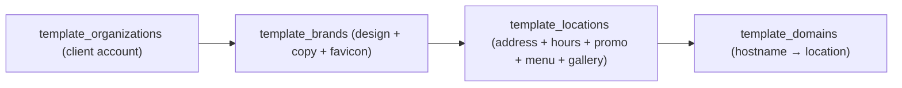
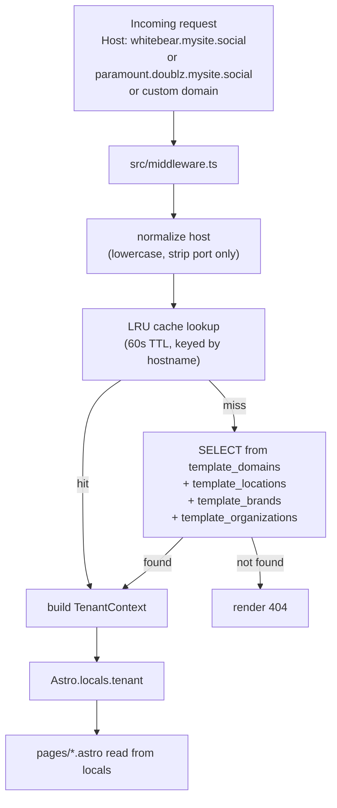

## Current State (2026-08-09)

**11 hostnames live on the same Vercel project** — one deploy, one codebase, per-request tenant resolution.

| Tenant | Kind | Hostname(s) | Photos |
|---|---|---|---:|
| MySite Demo (WBC) | `mysite_single` | [whitebear.mysite.social](https://whitebear.mysite.social), plus preview `website-template-iota-one.vercel.app` | 9 |
| Stacks on Route 66 | `mysite_single` | [stacks.mysite.social](https://stacks.mysite.social) | 6 |
| Doublz (× 8 locations) | `mysite_multi` | [paramount](https://paramount.doublz.mysite.social), montebello, la-puente, el-monte, santa-fe-springs, lancaster, palmdale, nashville · all under `.doublz.mysite.social` | 4 (shared) |
| U Babci Polish Cuisine | `mysite_single` | [ubabci.mysite.social](https://ubabci.mysite.social) | 4 |

All gallery + logo + favicon assets are self-hosted under Supabase Storage (`assets` bucket, `logos/`, `favicons/`, `gallery/`, `gallery-v3/`, `menu/` paths). Zero external image URLs.

## Goals (unchanged)

- **One codebase, hundreds of sites.** Single Vercel deploy, wildcard domains, host-based tenant resolution. `mysite.social` is the customer-facing site domain; `mysite.cx` remains internal ops/API (`attribution.mysite.cx`).
- **Design language.** MySite's shadcn `base-nova` tokens (Geist, OKLCH neutrals) applied through Apple/shadcn composition patterns (unified Card containers, consistent spacing rhythm, sticky category tabs).
- **Trivially onboardable.** Adding a client = insert rows in Supabase + attach domain in Vercel. Zero code changes.
- **Content is real.** Every tenant's gallery is scraped from that tenant's live site and self-hosted — no Unsplash stock. If the origin CDN goes down, our sites still render.
- **Fast.** Mobile gallery total < 100 KB per tenant. Responsive WebP (400/800/1600), first tile eager+high-priority.

## Tech Stack (as shipped)

- **Astro 5** (`output: "server"`, `@astrojs/vercel`) for SSR + per-request tenant resolution.
- **React 19 islands** for interactive UI (`MenuBrowser`, `GalleryBrowser`, `PromoFlow`, `PromoBanner`, `MetaPixel`, `Umami`).
- **shadcn/ui `base-nova`** vendored into `src/components/ui/` (`baseColor: "neutral"`, `cssVariables: true`, `iconLibrary: "lucide"`). Uses `@base-ui/react` primitives for Radix-parity.
- **Tailwind CSS 4** via `@tailwindcss/vite`, tokens through `@theme inline` in `src/styles/tokens.css`.
- **Fonts**: `@fontsource-variable/geist` — `--font-sans: 'Geist Variable', sans-serif`.
- **Supabase** — project `tkltfqshwwxykxhxthem` (dedicated). Service role on server only. `anon_deny_all` on every `template_*` table.
- **TypeScript 5**, strict.
- **Deployment**: single Vercel project `website-template` (id `prj_JYfSDahupquA9z60VzUNf4QVQ7RT`) under team `mysiteai`. Wildcards `*.mysite.social` + `*.*.mysite.social`.
- **Analytics**: Meta Pixel (per-location `meta_pixel_ids`), Umami (`umami_website_id`, `/stats/` same-origin proxy → `umami-mysiteai.vercel.app`).
- **Attribution**: direct integration with `attribution-autopilot` (`attribution.mysite.cx/api`). CORS via `location_origins` allowlist.
- **Images**: WebP everywhere. Gallery served in 3 sizes with `srcset`. cwebp @ q78 m6 for encoding.

## Hosting & Domain Model

Two prerequisites confirmed at build time:

1. **`mysite.social` is registered** and pointed at Vercel. Wildcard TLS for `*.mysite.social` and `*.*.mysite.social` are both live and verified.
2. **Nested wildcard TLS works** on the same Vercel project — verified with `paramount.doublz.mysite.social`, `nashville.doublz.mysite.social` and 6 other Doublz locations (all `HTTP 200` with valid Vercel-issued certs).

The template supports **three host shapes**, all resolved by the same middleware from `template_domains`:

- **Single-location** (`mysite_single`): `<slug>.mysite.social` — e.g. `whitebear.mysite.social`, `stacks.mysite.social`, `ubabci.mysite.social`. `brand.slug === location.slug` (they collapse). Enforced by the `template_domains_allow_single` trigger.
- **Multi-location** (`mysite_multi`): `<location>.<brand>.mysite.social` — e.g. `paramount.doublz.mysite.social`. Wildcard-of-wildcard TLS confirmed working.
- **Custom** (`custom`): any hostname the client owns (e.g. `karat.pl`, `www.karat.pl`, `paramount.doublz.com`). Add the domain in Vercel dashboard + insert a `template_domains` row.

**Bare brand root** (`doublz.mysite.social` with no `<location>` prefix) → **404**. The `template_domains_allow_single` trigger rejects any `<slug>.mysite.social` row where `brand.slug ≠ location.slug`. Defense in depth: no row + trigger CHECK.

Vercel domain configuration:

- Wildcards `*.mysite.social` and `*.*.mysite.social` are configured once at project level.
- Every custom domain (`karat.pl` etc.) is attached individually via Vercel dashboard or REST API (`POST /v10/projects/{id}/domains`).

`template_domains` is authoritative. The middleware does **no** structural parsing of the host — every hostname is a row pointing at a single `location_id`. Adding an alias (e.g. `www.karat.pl` alongside `karat.pl`) = one row insert.

## Domain Model (Supabase project `tkltfqshwwxykxhxthem`)

Dedicated Supabase project, separate from `attribution-autopilot`. Reason: this project holds public read-only marketing content — schema, RLS, and access patterns are unrelated to attribution. Handing the project to a non-technical operator does not expose attribution PII.

Migration hygiene: **every schema change is a checked-in SQL migration** under `supabase/migrations/`. No Studio drift. Migrations are numbered `001`–`022` and executed in order.

Three-tier hierarchy:



Table columns (as shipped):

- `template_organizations` — `id`, `slug`, `name`, `default_locale` (`en` / `pl`), `created_at`, `updated_at`.
- `template_brands` — `id`, `org_id`, `slug`, `name`, `logo_url`, `favicon_url` (added in migration 017), `theme` (JSONB: `{ primary?: oklch, primary_foreground?: oklch }`), `tagline`, `about_md`, `created_at`, `updated_at`.
- `template_locations` — `id`, `brand_id`, `slug`, `name`, `address_line`, `city`, `region`, `postal_code`, `country`, `latitude`, `longitude`, `phone`, `email`, `weekday_hours`, `weekend_hours`, `maps_embed_url`, `maps_search_query`, `instagram_url`, `facebook_url`, `delivery` (JSONB `{name,url}[]`), `attribution_org_id`, `attribution_location_id`, `attribution_promotion_id`, `attribution_campaign_id` (all four FKs into `attribution-autopilot`), `promotion_name_cached`, `reward_description_cached`, `umami_website_id`, `meta_pixel_ids` (text[]), `gallery` (JSONB `{src, alt}[]`), `menu` (JSONB — see below), `created_at`, `updated_at`.
- `template_domains` — `hostname` (PK, exact-match — no `www.` stripping), `location_id`, `is_primary`, `kind` (`mysite_single` | `mysite_multi` | `custom`), `created_at`. Trigger `template_domains_allow_single` validates the `<slug>.mysite.social` shape.

### Menu JSON Shape (validated at read time)

```ts
// src/lib/menu/types.ts
export type Money = { amount: number; currency: "PLN" | "EUR" | "USD" };

export interface MenuItem {
  id: string;
  name: string;
  description?: string;
  price?: Money;
  image_url?: string;
  tags?: Array<"vegan" | "vegetarian" | "gluten-free" | "spicy" | "new">;
  allergens?: string[];
}

export interface MenuCategory {
  id: string;
  name: string;
  description?: string;
  items: MenuItem[];
}

export interface Menu {
  version: 1;
  currency_default: "PLN" | "EUR" | "USD";
  categories: MenuCategory[];
}
```

Enforced by zod in `src/lib/menu/parse.ts`. If a location's `menu` blob fails validation, `/menu` renders "menu coming soon" instead of crashing.

**Real-world footgun** (documented in `docs/08-managing-tenants.md`): missing `version: 1` or `currency_default`, or using `tags: [signature|popular]` (outside the enum), silently produces the fallback state. Migrations 020 → 022 include this shape correctly.

### RLS (`003_rls.sql`)

`anon_deny_all` on every `template_*` table. Tenant resolution runs SSR against `SUPABASE_SERVICE_ROLE_KEY`; the template ships zero client-side Supabase reads. PII (`phone`, `email`) never crosses the SSR boundary.

Function `search_path` hardened in `004_harden_function_search_paths.sql` (`set_updated_at`, `template_domains_allow_single`).

## Tenant Resolution Flow



Implementation (`src/lib/tenant/resolve.ts` + `src/middleware.ts`):

- Middleware reads `Astro.request.headers.get("host")`, normalizes (lowercase, strip port; `www.` NOT stripped — stored as separate rows).
- 60-second in-memory LRU cache keyed by hostname. Redeploy or wait 60s to pick up domain changes (natural TTL only — no realtime invalidation in v1).
- Zero structural parsing of the host. Every URL shape is just a hostname lookup.
- No `?tenant=` preview override in v1 (removed — was dead code with Vercel-built `import.meta.env.DEV=false`).
- Every `.astro` page reads `Astro.locals.tenant` — no per-page fetching, no prop drilling.

**Live tenant snapshot** (as of migration 022):

- `whitebear.mysite.social`, `website-template-iota-one.vercel.app` → MySite Demo → WBC Marszałkowska
- `stacks.mysite.social` → Stacks on Route 66 → Glendora CA
- `ubabci.mysite.social` → U Babci → Lake Forest CA
- 8× `<location>.doublz.mysite.social` → Doublz brand → paramount, montebello, la-puente, el-monte, santa-fe-springs, lancaster, palmdale, nashville

## Pages (as shipped)

Four routes, all SSR, tenant-scoped via `Astro.locals.tenant`:

1. `src/pages/index.astro` — Landing. Sections: Hero (logo + name + tagline + city/region + `PromoBanner` React island), QuickActions (Call · Directions · Menu · Order), Hours, Socials, Gallery (React island with lightbox), MenuPreview, About, MapEmbed, Delivery. Footer with `MysiteBadge`.
2. `src/pages/menu.astro` — Full menu via `<MenuBrowser client:visible>` React island. Sticky category tabs, currency formatted per-location.
3. `src/pages/promocja.astro` — Loyalty/QR page. Mounts `<PromoFlow client:load>`. Includes `shareQrImage` (canvas → PNG → `navigator.share`, ported verbatim from `wbc-v2`).
4. `src/pages/404.astro` — Unknown-host or unknown-slug fallback.

All pages share `src/layouts/BaseLayout.astro` which injects `<BrandStyleTag>`, `<LocationSEO>`, `<MetaPixel client:idle>`, `<Umami client:idle>`, and the mysite.ai favicon fallback chain.

## Attribution Autopilot Integration (as shipped)

Direct port of `wbc-v2`'s `useQrTracker` — same endpoints, same payload shape, same phone-append + duplicate-recovery flow.

- **`src/lib/attribution/client.ts`** — `fetch` wrapper around `POST /api/users`, `PATCH /api/users/:id/phone`, `GET /api/users/:id`, `GET /api/users/phone/:phone`, `POST /api/users/recover/{request,verify}`. Base URL from `PUBLIC_ATTRIBUTION_API_BASE` (default `https://attribution.mysite.cx/api`).
- **`src/lib/attribution/tracking.ts`** — collects `_fbc`/`_fbp`/`_ga`/first `_ga_*`, `fbclid`, UTMs, `r`/`c`, `multiFbc` from `localStorage`. Matches `wbc-v2` exactly. `gclid`/`gbraid`/`wbraid` intentionally NOT captured; backend accepts them if a future client needs them.
- **`src/lib/attribution/useAttribution.ts`** — React hook, direct port of `useQrTracker.ts`, adapted to read `promotion_id`/`campaign_id`/`org_id` from `Astro.locals.tenant.location.attribution_*` instead of `useLocationConfig()`. Same `registerPromise` + `lockRef` dedupe, same `localStorage.qr_user` / `qr_user_phone` caching, same `GET /users/phone/:phone` probe-then-swap duplicate detection.
- **`src/components/promo/PromoFlow.tsx`** — React island. Flow: `teaser → revealed → phone → done`. Emits the same Meta Pixel event pair (`QRGenerated` on reveal, `Lead` on phone save), deduped via server-side event-id.
- **`src/components/promo/PromoBanner.tsx`** — compact click-bait pill in the hero. Uses `bg-primary` for tenant themeability, matching `wbc-v2`'s live pattern.
- **`src/lib/promo/shareQrImage.ts`** — port of `saveQrImage()` from `wbc-v2`. Renders QR + reward + address + domain + "powered by mysite.ai" as 600×800 PNG on canvas, then `navigator.share` with fallback to download.
- **`src/lib/promo/usePromoCountdown.ts`** — countdown hook, kept in codebase but currently unused (Hero removed the countdown to match `wbc-v2` live pattern).

### Promo display strings

`POST /api/users` was extended to return `promotion_name` and `first_reward_description`. The change lives in `attribution-autopilot/src/users/users.service.ts` (still uncommitted at the time of this plan — tracked in `git status`). Values are also denormalized into `template_locations.promotion_name_cached` / `reward_description_cached` for SSR pre-reveal rendering. Refresh procedure in `docs/04-attribution-integration.md`.

### Server-side event IDs

Template passes `qr_event_id` and `lead_event_id` from day one. Attribution-autopilot fans out to CAPI/Rudderstack/CustomerIO server-side. No CAPI/Rudderstack calls originate from the template itself.

### CORS onboarding — one path

Every new hostname must be inserted into `attribution_autopilot.location_origins` with `location_id = <template_locations.attribution_location_id>` and `origin = "https://<hostname>"`. **60-second cache lag** in `LocationsService.getAllOriginsCached()` — wait ~60s after INSERT before smoke-testing `/promocja`. Documented in `docs/02-adding-a-client.md`.

The static regex allowlist in `src/common/origin-allowlist.ts` requires a backend redeploy + code review, is not compatible with zero-code onboarding, and is not used for template clients.

## Design System (as shipped)

**Base**: MySite's own shadcn `base-nova` tokens. Copied verbatim from `attribution-autopilot/admin/src/index.css`.

- `style: "base-nova"`, `baseColor: "neutral"`, `iconLibrary: "lucide"`, `cssVariables: true`.
- Font: `@fontsource-variable/geist` → `--font-sans: "Geist Variable", sans-serif`.
- OKLCH neutrals. Radius `--radius: 0.625rem` with derived `sm..4xl` scale.
- Tailwind 4 with `@theme inline` in `src/styles/tokens.css`.

**Composition layer** in `src/styles/components.css` — shipped simpler than the plan originally called for. Every content surface uses the shadcn `Card` primitive rather than custom `.map-card`/`.action-tile` classes (refactor in commit `ec911ad`). This keeps vertical rhythm, radius, and ring treatment uniform across Hero, Hours, Gallery, MenuPreview, About, MapEmbed, Delivery.

**Per-brand override** — `template_brands.theme` (JSONB) can override only two variables:

- `--primary` — accepts an OKLCH string.
- `--primary-foreground`

`<BrandStyleTag>` injects `<style>html:root{...}</style>` — selector specificity bumped to `html:root` (commit `80113ff`) so the inline style wins over `globals.css`.

`--radius` is deliberately NOT overridable (Tailwind 4 `@theme inline` resolves derived radius at build time).

**Live tenant colors** (as of migration 022):

- WBC: warm orange `oklch(0.68 0.17 40)` (migration 012)
- Stacks: retro red `oklch(0.55 0.19 25)`
- Doublz: bright yellow (matches their logo)
- U Babci: Polish crimson `oklch(0.55 0.20 25)` (godło Polski)

## Directory Layout (as shipped)

```
website-template/
├─ astro.config.mjs                          # SSR + Vercel adapter + image.domains whitelist
├─ tsconfig.json
├─ package.json
├─ vercel.json                               # /stats/ proxy to umami-mysiteai.vercel.app
├─ .env.example
├─ README.md
├─ components.json                           # shadcn base-nova + @base-ui/react
├─ docs/
│  ├─ 01-architecture.md
│  ├─ 02-adding-a-client.md
│  ├─ 03-design-system.md
│  ├─ 04-attribution-integration.md
│  ├─ 05-supabase-schema.md
│  ├─ 06-developer-guide.md
│  ├─ 07-domain-model.md                     # DNS, wildcard TLS, CNAME setup for mysite.social
│  └─ 08-managing-tenants.md                 # SQL cookbook: colours, logos, menu, favicon, promo refresh
├─ supabase/migrations/
│  ├─ 001_template_orgs_brands_locations.sql
│  ├─ 002_template_domains.sql               # + template_domains_allow_single trigger
│  ├─ 003_rls.sql                            # anon_deny_all
│  ├─ 004_harden_function_search_paths.sql
│  ├─ 005_seed_smoke_test_tenant.sql
│  ├─ 006_default_locale_en_and_us_demo.sql
│  ├─ 007_wire_demo_attribution.sql
│  ├─ 008_rebrand_demo_wbc.sql
│  ├─ 009_refresh_demo_promo_cache.sql
│  ├─ 010_localize_demo_delivery.sql
│  ├─ 011_switch_reserved_domain_to_mysite_social.sql
│  ├─ 012_demo_wbc_brand_color.sql
│  ├─ 013_rename_demo_slugs_to_whitebear.sql
│  ├─ 014_add_production_hostname.sql
│  ├─ 015_seed_stacks_tenant.sql
│  ├─ 016_seed_doublz_multi_location.sql     # 8 locations
│  ├─ 017_add_favicon_url.sql                # + favicon_url column on template_brands
│  ├─ 018_update_logos_favicons_gallery.sql
│  ├─ 019_selfhost_gallery_images.sql
│  ├─ 020_seed_ubabci_tenant.sql
│  ├─ 021_real_photos_from_client_sites.sql  # scrape + self-host real photos from client sites
│  └─ 022_gallery_responsive_webp.sql        # 3× WebP variants (400/800/1600w) + srcset
├─ src/
│  ├─ middleware.ts
│  ├─ env.d.ts
│  ├─ layouts/BaseLayout.astro
│  ├─ lib/
│  │  ├─ tenant/{resolve.ts, types.ts}       # + 60s LRU cache
│  │  ├─ supabase/{server.ts, types.ts}
│  │  ├─ attribution/{client.ts, tracking.ts, useAttribution.ts, metaPixel.ts}
│  │  ├─ promo/{shareQrImage.ts, usePromoCountdown.ts}
│  │  ├─ menu/{types.ts, parse.ts}
│  │  ├─ seo/schema.ts
│  │  └─ utils.ts
│  ├─ styles/{globals.css, tokens.css, components.css}
│  ├─ components/
│  │  ├─ ui/                                 # shadcn base-nova primitives
│  │  ├─ layout/{Header, Footer, BrandStyleTag, MysiteBadge}.astro
│  │  ├─ sections/
│  │  │  ├─ Hero.astro
│  │  │  ├─ QuickActions.astro
│  │  │  ├─ Hours.astro
│  │  │  ├─ Socials.astro
│  │  │  ├─ Gallery.astro                    # thin wrapper → GalleryBrowser React island
│  │  │  ├─ GalleryBrowser.tsx               # React island, 2/3-col square grid + lightbox + srcset
│  │  │  ├─ MenuPreview.astro
│  │  │  ├─ About.astro
│  │  │  ├─ MapEmbed.astro
│  │  │  └─ Delivery.astro
│  │  ├─ menu/MenuBrowser.tsx                # React island, sticky category tabs
│  │  ├─ promo/{PromoBanner.tsx, PromoFlow.tsx}
│  │  └─ attribution/{MetaPixel.tsx, Umami.tsx}
│  └─ pages/{index.astro, menu.astro, promocja.astro, 404.astro}
```

Notes:
- No `tailwind.config.ts`. Tailwind 4 uses `@theme` in CSS.
- `tokens.css` copies `admin/src/index.css` verbatim; brings along `tw-animate-css` + `@fontsource-variable/geist`.
- `astro.config.mjs` whitelists `tkltfqshwwxykxhxthem.supabase.co` under `image.domains` and `image.remotePatterns` (added in commit `39d9572`) so future Vercel Image Optimization can operate on our gallery assets on top of pre-encoded WebPs.

## Assets & Performance (as shipped)

All logos, favicons, and gallery images are self-hosted under Supabase Storage bucket `assets`. **Zero external image URLs remain in the database.** If a client CDN goes down, our sites keep rendering.

Storage path convention:

```
assets/
├─ logos/                # <slug>-logo.{png,jpg,svg}
├─ favicons/             # <slug>.svg
├─ gallery/              # legacy v1 path (still populated for U Babci at v1 resolution)
├─ gallery-v3/           # canonical v3 path — three WebP variants per photo
│  ├─ whitebear/         # <name>-{400,800,1600}w.webp
│  ├─ stacks/
│  ├─ doublz/
│  └─ ubabci/
└─ menu/                 # per-tenant menu item thumbnails (WBC only, for Flat White)
```

### Gallery pipeline (migration 022 + `GalleryBrowser.tsx`)

Each real photo scraped from a client site → three WebP variants:

- `-400w.webp` — mobile grid tile (~15–25 KB each)
- `-800w.webp` — desktop grid tile (~35–70 KB) — this is the URL stored in `template_locations.gallery[].src`
- `-1600w.webp` — lightbox / full-view (~90–250 KB, only fetched on click)

`GalleryBrowser.tsx` detects the `-800w.webp` suffix and emits `srcset="…-400w.webp 400w, …-800w.webp 800w, …-1600w.webp 1600w"` with `sizes="(min-width: 768px) 240px, (min-width: 640px) 32vw, 48vw"`. First tile is `loading="eager" fetchpriority="high"` (LCP); rest is `loading="lazy" decoding="async"` + `content-visibility: auto`.

**Measured per-tenant total gallery bytes** (mobile 400w path, first paint):

| Tenant | Photos | Before | After (mobile 400w) | Reduction |
|---|---:|---:|---:|---:|
| WBC | 9 | ~6 MB (raw JPGs, no cache) | **90 KB** | 68× |
| Stacks | 6 | ~2.5 MB | **77 KB** | 33× |
| Doublz | 4 | ~2 MB | **75 KB** | 27× |
| U Babci | 4 | **11.4 MB** (fullres Wix originals) | **84 KB** | **135×** |

### Caching behaviour

Supabase Storage on Free tier does not honour `Cache-Control: max-age` headers on public objects (always returns `no-cache`). Metadata is set correctly (`cacheControl=31536000` stored in `storage.objects.metadata`), but Cloudflare in front of Storage overrides it to `no-cache`. Effect on real users:

- **First visit**: full download (~84 KB for U Babci mobile).
- **Subsequent visits**: browser sends `If-None-Match`; CF returns `304 Not Modified` (`cf-cache-status: REVALIDATED`) with **zero bytes body**. Only cost is a ~50 ms round-trip per image.

In practice this is close to `max-age=31536000` cache behaviour. If it ever becomes a bottleneck, the escape hatch is a Vercel edge proxy `/cdn/gallery/*` with `s-maxage=31536000` — not needed today.

### Real photos (migration 021)

Every gallery is scraped from the client's live site. Documented in the migration header:

- WBC: 9 photos from `marszalkowska.thewhitebearcoffee.pl/images/*.webp` (interior, latte art, croissants, bar, coffee beans, roastery, cold brew, barista, pink latte).
- Stacks: 6 photos from `www.stacks66.com/_next/image` (diner exterior, fav skillet, omelette, tri tip, inside, storefront).
- Doublz: 4 photos + real logo from `le-cdn.hibuwebsites.com` (blue-yellow logo, breakfast plates, hero, club sandwich).
- U Babci: 4 photos + logo from `static.wixstatic.com` (catering buffet, Turek family kitchen, endive platter, kiełbasa canapés).

## Configuration & Secrets

Only three env vars — all others live in Supabase.

- `PUBLIC_SUPABASE_URL` — `https://tkltfqshwwxykxhxthem.supabase.co`
- `SUPABASE_SERVICE_ROLE_KEY` — server middleware only, never shipped to client. Given `anon_deny_all` RLS + zero client-side Supabase reads, no anon key is needed.
- `PUBLIC_ATTRIBUTION_API_BASE` — defaults to `https://attribution.mysite.cx/api`.

## Adding a New Client

### Pattern A — single-location (e.g. Karat, U Babci, Stacks)

1. **Assets** — collect real logo + gallery photos + favicon from the client's live site (never Unsplash / stock). Encode gallery to 3 WebP variants (400/800/1600w) via `cwebp -q 78 -m 6`. Upload to Supabase Storage `assets/{logos,favicons,gallery-v3/<slug>}/`.
2. **`website-template` Supabase** — insert `template_organizations`, `template_brands` (`brand.slug = location.slug`), `template_locations` (including `attribution_promotion_id`, `attribution_campaign_id`, `attribution_org_id`, `attribution_location_id` from the attribution-autopilot project; `promotion_name_cached`, `reward_description_cached`; `gallery` JSONB pointing to `gallery-v3/<slug>/*-800w.webp` URLs; `menu` JSONB with `version: 1` + `currency_default`). Insert `template_domains` row: `hostname="<slug>.mysite.social", is_primary=true, kind="mysite_single"`. For custom domains, additional rows with `kind="custom"` (separate row per hostname — no `www.` stripping).
3. **`attribution-autopilot` Supabase** — for each hostname, INSERT into `location_origins`. **Wait 60 s** for the CORS cache to refresh before smoke-testing `/promocja`.
4. **Vercel** — `<slug>.mysite.social` is covered by the `*.mysite.social` wildcard, nothing to do. Custom domain: attach via Vercel REST API or dashboard.

### Pattern B — multi-location (e.g. Doublz)

Same steps, one shared `template_organizations` + `template_brands`, one `template_locations` per venue, one `template_domains` per hostname:

- `<location>.<brand>.mysite.social`, `is_primary=true, kind="mysite_multi"` (nested wildcard TLS)
- `<location>.<brand>.<brand>.com`, `is_primary=false, kind="custom"` (if the client owns their own brand domain)

**Never insert** a row for bare `<brand>.mysite.social` — the `template_domains_allow_single` trigger rejects any single-label `<slug>.mysite.social` where `brand.slug ≠ location.slug`.

Site live in <5 minutes plus the 60 s CORS cache wait. Detailed cookbook in `docs/02-adding-a-client.md`.

## Managing Existing Tenants

`docs/08-managing-tenants.md` is the operator-facing SQL cookbook. Covers:

- Change primary/secondary colour via `template_brands.theme` JSONB.
- Swap logo / favicon URL.
- Edit `weekday_hours` / `weekend_hours` / delivery links.
- Replace a gallery photo (upload to `gallery-v3/<slug>/`, update the `-800w.webp` URL in `template_locations.gallery`).
- Edit menu items in `template_locations.menu`; make sure `version: 1` and `currency_default` are present and `tags[]` uses only the allowed enum.
- Refresh `promotion_name_cached` / `reward_description_cached` after renaming a promo in attribution-autopilot.
- Attach a new custom domain: (a) Vercel domain add, (b) INSERT into `template_domains`, (c) INSERT into `attribution.location_origins`, (d) wait 60 s.

## Live Tenants Directory

| slug | org | brand | locations | hostnames | primary theme |
|---|---|---|---:|---|---|
| `whitebear-coffee` | MySite Demo | `whitebear` | 1 (Marszałkowska, Warsaw) | `whitebear.mysite.social`, `website-template-iota-one.vercel.app` | warm orange |
| `stacks-on-route-66` | Stacks on Route 66 | `stacks` | 1 (Glendora CA) | `stacks.mysite.social` | retro red |
| `doublz` | Doublz | `doublz` | 8 (paramount, montebello, la-puente, el-monte, santa-fe-springs, lancaster, palmdale, nashville) | `<location>.doublz.mysite.social` × 8 | bright yellow |
| `ubabci` | U Babci | `ubabci` | 1 (Lake Forest CA) | `ubabci.mysite.social` | Polish crimson |

Total: 4 orgs / 4 brands / 11 locations / 12 hostnames.

## Out of Scope for v1

- Admin UI for editing Supabase content (operators use SQL or Supabase Studio; `docs/08-managing-tenants.md` is the cookbook).
- Menu editor (`template_locations.menu` is JSON conforming to `src/lib/menu/types.ts`).
- i18n runtime switcher (Polish + English content is authored per-tenant in `template_organizations.default_locale` + inline copy).
- Direct server-side CAPI/Rudderstack/CustomerIO calls from the template. `qr_event_id` + `lead_event_id` are passed to attribution-autopilot, which handles the server-side fan-out.
- Cookie consent gating (matches current `wbc-v2` gap; noted for later).
- Reservations, contact form, blog.
- Per-brand `--radius` override (Tailwind 4 `@theme inline` limitation; see Design System).
- Google Ads click-ID capture (`gclid`/`gbraid`/`wbraid`) — matches `wbc-v2`; add per-key if a future client needs it.
- SPA-style multi-venue-under-one-host (`wbc-v2`'s `LocationConfig.venues[]` pattern). Template's model is one hostname per location.
- Vercel edge-cached image proxy `/cdn/gallery/*`. Not needed today (Supabase Cloudflare CDN + browser 304s → effective for our byte sizes).
- Astro `<Image>` component / Vercel Image Optimization. Not needed today because we pre-encode 3 WebP variants — remotePatterns is configured so we can opt in later without a schema change.

## Success Criteria (as met)

- ✅ New restaurant site live in <5 minutes from Supabase row + DNS.
- ✅ `npm run build` clean, TypeScript strict, no `any`.
- ✅ Third-party scripts deferred: Meta Pixel + Umami mount as `client:idle`; map iframe uses `loading="lazy"`; gallery uses native lazy loading plus responsive `srcset` (first tile eager+high-priority); Geist Variable loaded with `font-display: swap`.
- ✅ Gallery total on mobile <100 KB for every tenant (measured: WBC 90 KB, Stacks 77 KB, Doublz 75 KB, U Babci 84 KB).
- ✅ Zero external image URLs in the database (self-hosted logos + favicons + galleries).
- ✅ Every gallery photo is authentic to the client (scraped from their live site, never stock).
- ✅ 4 real tenants live across 12 hostnames; end-to-end verified `HTTP 200` + CORS + attribution round-trip.
- ✅ A new developer can read `docs/` and ship a section change in under an hour (docs 01–08 all authored).

## Migration Log Reference

Chronological summary of what each migration did:

| # | File | Purpose |
|---|---|---|
| 001 | `template_orgs_brands_locations.sql` | Base schema: `template_organizations` + `template_brands` + `template_locations` |
| 002 | `template_domains.sql` | `template_domains` table + `template_domains_allow_single` trigger |
| 003 | `rls.sql` | `anon_deny_all` on every `template_*` table |
| 004 | `harden_function_search_paths.sql` | Set `search_path` on `set_updated_at`, `template_domains_allow_single` |
| 005 | `seed_smoke_test_tenant.sql` | Initial demo tenant (later rebranded to WBC) |
| 006 | `default_locale_en_and_us_demo.sql` | English + US demo content |
| 007 | `wire_demo_attribution.sql` | Attach demo tenant to a dedicated attribution promotion |
| 008 | `rebrand_demo_wbc.sql` | Rebrand demo → White Bear Coffee Marszałkowska |
| 009 | `refresh_demo_promo_cache.sql` | Sync cached display strings after promo rename |
| 010 | `localize_demo_delivery.sql` | Swap DoorDash / Uber Eats → Wolt / Glovo / Pyszne.pl for Warsaw |
| 011 | `switch_reserved_domain_to_mysite_social.sql` | Reserved-domain trigger uses `mysite.social` (was `mysite.so`) |
| 012 | `demo_wbc_brand_color.sql` | WBC primary → warm orange `oklch(0.68 0.17 40)` |
| 013 | `rename_demo_slugs_to_whitebear.sql` | Rename slugs to `whitebear` (needed for `mysite_single` trigger) |
| 014 | `add_production_hostname.sql` | Attach `whitebear.mysite.social` as primary hostname |
| 015 | `seed_stacks_tenant.sql` | Onboard Stacks on Route 66 |
| 016 | `seed_doublz_multi_location.sql` | Onboard Doublz brand with 8 locations |
| 017 | `add_favicon_url.sql` | Add `favicon_url` column to `template_brands` |
| 018 | `update_logos_favicons_gallery.sql` | Real Stacks JPG logo, Doublz gallery fix, favicon URLs for all 3 tenants |
| 019 | `selfhost_gallery_images.sql` | Move gallery URLs to self-hosted Supabase Storage paths |
| 020 | `seed_ubabci_tenant.sql` | Onboard U Babci Polish Cuisine — Lake Forest CA |
| 021 | `real_photos_from_client_sites.sql` | Replace every stock/Unsplash placeholder with real photos scraped from each client's live site; self-host all |
| 022 | `gallery_responsive_webp.sql` | Point every gallery URL at responsive 3-size WebP variants (`gallery-v3/<tenant>/<name>-{400,800,1600}w.webp`) |

## Reference URLs

- Supabase project (content): [tkltfqshwwxykxhxthem.supabase.co](https://tkltfqshwwxykxhxthem.supabase.co)
- Attribution API: [attribution.mysite.cx/api](https://attribution.mysite.cx/api)
- Umami analytics (proxied): `/stats/` → `umami-mysiteai.vercel.app`
- Vercel project id: `prj_JYfSDahupquA9z60VzUNf4QVQ7RT` (team `team_NFjiJpAJwxYNFDSdk05dln8Z`, `mysiteai`)
- GitHub: [github.com/mysite-ai/website-template](https://github.com/mysite-ai/website-template)

Every operational URL an operator needs is listed here; anything else is a docs/ or source-tree reference.
