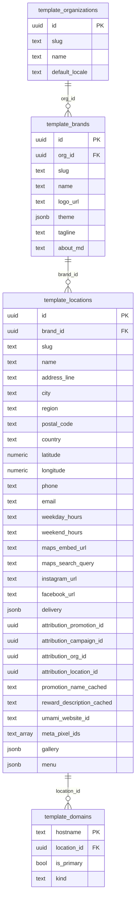

# 05 — Supabase schema

The `website-template` Supabase project is a **new, dedicated project**, separate from `attribution-autopilot`, `wbc-token`, `attribution-token`, and any existing MySite project. Rationale: it holds public read-only marketing content served to every restaurant visitor. Keeping it isolated prevents accidental cross-contamination, simplifies RLS, and lets us hand the project to a non-technical operator without exposing attribution PII.

## Provisioning

1. Create a new Supabase project named `website-template`.
2. Copy `PUBLIC_SUPABASE_URL` and `SUPABASE_SERVICE_ROLE_KEY` into `.env`.
3. Apply the three migrations in `supabase/migrations/` in order:
   - `001_template_orgs_brands_locations.sql`
   - `002_template_domains.sql`
   - `003_rls.sql`

Every table is created via SQL migrations checked into git. Unlike `attribution-autopilot` — whose base tables (`organizations`, `locations`, `users`, `promotions`, `loyalty_campaigns`) were created in Supabase Studio and whose `001_enable_rls.sql` only enables RLS on `ALTER TABLE IF EXISTS` — this project's schema is fully reproducible from the repo.

## ER diagram



## About `template_brands`

`attribution-autopilot` has no `brands` table — its hierarchy is `organizations → locations` directly. `template_brands` is a **new modeling decision** specific to this template, introduced to solve two problems that don't exist on the attribution side:

1. URL shape for multi-location brands (`<location>.<brand>.mysite.so`).
2. Shared design tokens + copy across locations under one brand.

Don't describe it as "mirroring the attribution schema" — it isn't.

## About attribution FKs

`template_locations.attribution_*` columns are **soft FKs**: they store UUIDs that live in another Supabase project. There is no real FK constraint because Postgres can't enforce one across projects.

- `attribution_promotion_id`, `attribution_campaign_id`, `attribution_org_id` — passed into the `POST /api/users` body from `PromoFlow`.
- `attribution_location_id` — the value operators insert into `attribution-autopilot.location_origins.location_id` when onboarding a new hostname.

## Domain resolution rules

Encoded in `002_template_domains.sql`:

- `hostname` is stored **lowercased, exact-match**. `www.karat.pl` and `karat.pl` are separate rows.
- `is_primary` — exactly one primary per location, enforced by a partial unique index `WHERE is_primary`.
- The `template_domains_validate` trigger REJECTS hostnames matching `^[a-z0-9-]+\.mysite\.so$` UNLESS `kind='mysite_single'` AND `brand.slug = location.slug` for that location. This is how "brand root → 404" is enforced at the DB level.

## RLS

`003_rls.sql` enables RLS on all four tables and adds an explicit `anon_deny_all` policy. Service_role bypasses RLS, which is how the tenant resolver reads the tables. No other role gets rows.

## Menu JSON template

The canonical shape is defined in `src/lib/menu/types.ts` and validated with zod at read time in `src/lib/menu/parse.ts`. Invalid blobs fall back to a "menu coming soon" state — the page doesn't crash.

Copy-paste template for operators:

```json
{
  "version": 1,
  "currency_default": "USD",
  "categories": [
    {
      "id": "coffee",
      "name": "Coffee",
      "description": "Locally roasted, single-origin.",
      "items": [
        {
          "id": "flat-white",
          "name": "Flat White",
          "description": "Double ristretto, silky steamed milk.",
          "price": { "amount": 5, "currency": "USD" },
          "tags": ["new"],
          "allergens": ["milk"]
        },
        {
          "id": "matcha-latte",
          "name": "Matcha Latte",
          "price": { "amount": 6, "currency": "USD" },
          "tags": ["vegan"]
        }
      ]
    },
    {
      "id": "brunch",
      "name": "Brunch",
      "items": [
        {
          "id": "shakshuka",
          "name": "Shakshuka",
          "description": "Two eggs poached in spiced tomato sauce, feta, herbs.",
          "price": { "amount": 16, "currency": "USD" }
        }
      ]
    }
  ]
}
```

Constraints (validator will reject otherwise):

- `version` MUST be `1`.
- `currency_default` and every `price.currency` MUST be one of `"PLN" | "EUR" | "USD"`.
- Every category and item needs a stable `id` (URL-safe slug) and a `name`.
- `price` is optional — omit for market-price / seasonal items (renders as "Market price").
- Allowed `tags`: `"vegan" | "vegetarian" | "gluten-free" | "spicy" | "new"`.
- `allergens` is free-form.

## Updating a location's menu

```sql
update template_locations
   set menu = '<paste JSON here>'::jsonb
 where id = '<location_id>';
```

There is no menu editor UI in v1 — operators use Supabase Studio's row editor.
